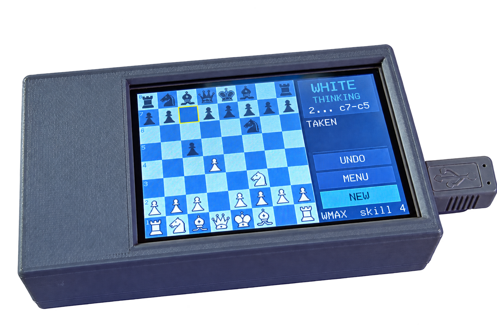

# Megachess

Chess on an Arduino Mega 2560 R3 with the DIYables 3.5" 480x320 touch shield.



Tap a piece, tap where it goes. Play the engine, play a friend on the one
screen, or let the engine play itself. Five board themes, a saved game you can
resume after a power cut, a PGN log of every finished game, and an opening book
— the last three from the SD card.

| | |
|---|---|
| rules, and the search at SKILL 1–2 | [MicroChess](https://github.com/ripred/MicroChess) by Trent M. Wyatt, MIT, in `src/engine` |
| the search at SKILL 3–7 | [micro-Max 4.8](http://home.hccnet.nl/h.g.muller/max-src2.html) by H.G. Muller, in `src/umax` |
| display and touch | DIYables_TFT_Touch_Shield 2.2.1 |
| artwork, UI, storage, engine glue | this sketch |

Built for `arduino:avr:mega`. Current size: **76.4 KB flash (30%)**, **4729 B
RAM (57%)**, leaving 3.4 KB for the searches' recursion; micro-Max was measured
using up to 1.9 KB of that.

---

## Parts

| part | notes |
|---|---|
| Arduino Mega 2560 R3 | the 256 KB of flash and the SPI on pins 50–52 are why it is a Mega and not an Uno |
| DIYables 3.5" 480x320 TFT touch shield | resistive touch, microSD slot; HX8357D driver on current units, RM68140 on earlier ones ([product page](https://diyables.io/products/3.5-320x480-tft-lcd-color-touch-screen-shield-for-arduino-uno-mega)) |
| microSD card | any size from 1 GB up, FAT32 with MBR; it needs under half a megabyte. Built with a 16 GB card. Plus a reader for the PC |
| 3 short wires, soldered | on the underside of the Mega, pins 50, 51, 52 to D12, D11, D13 — see below. The case leaves no room for jumper wires on the headers |
| USB A-to-B cable | powers it and programs it |
| stylus | optional; a fingernail works on the resistive panel |
| the printed case | two parts, see [The case](#the-case) |

Software: Arduino IDE 2 (its bundled arduino-cli does the builds here), the
DIYables_TFT_Touch_Shield library 2.2.1 and the SD library 1.3.0, Python 3 with
Pillow for the tools (skia-python as well to re-render the piece art), and,
only for the simulator, Visual Studio's C++ compiler.

---

## Run this first

```bash
arduino-cli compile -b arduino:avr:mega --upload -p COM8 bringup
```

`bringup/bringup.ino` answers the three things that have to be true before the
game is worth running.

**1. Which driver IC?** DIYables ship this board with an RM68140 (early units)
or an HX8357D (later ones, after a chip shortage). Both use library 2.x and
share an API — only the class name differs, and the wrong one gives a blank or
garbled screen. The sketch paints a card for each; tap whichever renders
correctly and it prints the line to paste into `megachess.h`:

```c
#define MEGACHESS_DRIVER_RM68140     // or MEGACHESS_DRIVER_HX8357D
```

The default is RM68140. If *neither* card renders, you have the older,
discontinued ILI9488 shield, which needs library **v1.0.0** instead — that
version has the `DIYables_TFT_ILI9488_Shield` class this one dropped.

**2. Does touch land where you press?** After you tap, it switches to a touch
test with corner targets. If the crosshair sits off them, run the library's
`TouchCalibration` example and paste its four numbers into `ui_begin()` in
[ui.cpp](ui.cpp).

**3. Is the SD card reachable?** Checked at boot, reported on Serial at 115200.
Expect it to fail until you add three wires — see below.

---

## The SD card needs three jumpers on a Mega

This is DIYables' own note, not a fault:

> On Arduino Mega, the microSD card slot (D10–D13) does not work without extra
> wiring because the Mega's SPI pins are on D50–D53.

The shield's SD lines sit on the Uno SPI footprint. The Mega's hardware SPI is
elsewhere, so bridge them:

| Mega pin | to shield pin | signal |
|---|---|---|
| 50 | D12 | MISO |
| 51 | D11 | MOSI |
| 52 | D13 | SCK |
| — | D10 | CS — ordinary GPIO, already fine |

Jumper wires on the headers will do for a test on the bench, but the case
has no room for them: solder three short wires on the underside of the Mega,
from the pads of 50, 51 and 52 to the pads of D12, D11 and D13.

**Everything works without the card.** You lose the SD-loaded artwork (the
built-in 1-bit pieces stand in), saving, the PGN log and the opening book. The
chess is untouched.

### What goes on the card

FAT32, MBR — which is what yours already is. Written for you:

```
/PIECES/AMBER.SET        full-colour piece artwork, one per theme
/PIECES/CLASSIC.SET
/PIECES/POCKET.SET
/PIECES/SLATE.SET
/PIECES/VECTOR.SET
/MCHESS/BOOK.TXT         opening lines, editable
/MCHESS/SAVE.DAT         written as you play, removed when a game ends
/MCHESS/SETTINGS.DAT     mode, skill, theme, orientation, touch calibration
/MCHESS/GAMES.PGN        every finished game, appended
/IMAGES/SPLASH.IMG       boot picture, optional: tools/LOGO.png through tools/splash.py
```

`SD_DATA/` in the repo is this card, file for file; copy it over. MCHESS is
the firmware's own folder and it creates it; IMAGES is yours. Every name
is 8.3 on purpose: the Arduino SD library cannot open anything longer, folders
included, and it fails without a word. The folder was MEGACHESS once, and the
Mega never read or wrote a byte in it. The simulator refuses such names too.

---

## Playing

**Menu.** Mode (vs engine / 2 player / engine demo), skill 1–7 (1–2 is
MicroChess searching that many plies, 3–7 is micro-Max on a clock of 1, 2.5, 5,
10 or 20 seconds — the label says which), which colour you take, theme, board
orientation. `RESUME` lights up when the card
holds an unfinished game.

**Board.** Tap a piece to pick it up — its legal destinations appear as dots,
and rings around pieces it can take. Tap a destination to play it, tap the
piece again to put it down, or tap another of your pieces to switch. The last
move keeps an amber border; a king in check gets a red one.

**UNDO** steps back a full move in vs-engine mode (yours *and* the engine's
reply), one half-move otherwise. Four half-moves are kept.

Pawns auto-queen — the engine has no underpromotion, so there is no piece
picker to show you.

### A quirk worth knowing

MicroChess scores "moved and left my own king attacked" as an immediate loss
rather than an illegal move. That is fine for the engine, but it would mean a
mis-tap loses you the game, so `apply_move()` plays the move, checks your king,
and takes it straight back with **KING IN CHECK** if it hangs.

The move dots are the engine's pseudo-legal list, so a square that would hang
your king still shows a dot. Filtering them properly needs a trial move per
destination — about a second per piece on a 16 MHz AVR — which is why the check
happens on the tap instead.

---

## Themes and artwork

Five themes, switchable from the menu, defaulting to **Amber**. Board colours
live in [themes_gen.h](themes_gen.h); the matching pieces are on the card.

The card artwork is the **Alpha** chess set by Eric Bentzen, as shipped in
lichess (`public/piece/alpha`, free to use), rasterised per theme by
[tools/svgpieces.py](tools/svgpieces.py): each SVG's fills and strokes are
substituted with the theme's piece colours, rendered at 8x through Skia, and
LANCZOS-downsampled to 40x40. To rebuild after a theme change:

```bash
python tools/svgpieces.py alpha alpha H:\PIECES
```

Card artwork is 40x40 RGB565 **with an alpha channel**, blended against the
square underneath as it is drawn. That is why pieces have clean antialiased
edges on both light and dark squares — a colour-key cutout cannot do that. The
built-in fallback is three 1-bit layers (body, rim, internal detail), which
keeps a black piece reading as a dark silhouette rather than a light-outlined
one on a light square.

To change colours or add a theme, edit `THEMES` in [tools/themes.py](tools/themes.py) and:

```bash
python tools/build_assets.py H:\
```

That rewrites the `.SET` files, `pieces_bmp.h` and `themes_gen.h` from the one
table, so the card and the firmware cannot drift apart. `python tools/mock2.py`
renders PNG mockups at the real 480x320 to check a theme without flashing.

---

## The opening book

`/MCHESS/BOOK.TXT` — one opening per line, long algebraic, `#` for comments:

```
e2e4 e7e5 g1f3 b8c6 f1c4 g8f6 d2d3 f8c5 c2c3 d7d6
d2d4 g8f6 c2c4 g7g6 b1c3 f8g7 e2e4 d7d6 g1f3 e8g8
```

When the game so far matches the start of a line, the engine plays that line's
next move, choosing at random among all matching lines so it varies. Once play
leaves the book it stops looking and searches normally.

The 33 shipped lines were checked move-by-move with `python-chess` — 330 plies,
all legal. Lines you add are *not* validated: an illegal move is ignored and
the engine searches instead.

This replaces MicroChess's built-in book, which was one hard-coded line for one
side (`options.openbook` is left off).

---

## PGN log

Finished games append to `/MCHESS/GAMES.PGN`. Moves are written in **long
algebraic** (`e2e4`, `Nb1c3`, `Bf1xc4`), not strict SAN — it needs no
disambiguation pass, and lichess, SCID and ChessBase all import it. If you want
strict SAN, the place to add it is `lan()` in [storage.cpp](storage.cpp).

---

## Two engines

MicroChess is the rules. It generates the move list you see as dots, plays
every move, and detects check, mate and repetition. At SKILL 1 and 2 it also
chooses the engine's move, searching 1 or 2 plies.

From SKILL 3 up the move comes from micro-Max 4.8, H.G. Muller's engine in
under 2 KB of C, in `src/umax`. On the engine's turn the position is copied
onto micro-Max's own 0x88 board, it searches for the level's clock, and the
move it names is played through MicroChess exactly as a human's would be:
checked against MicroChess's move list for that piece first. Should the two
ever disagree, MicroChess's own search decides and a line saying so goes to
Serial. In a 126-move simulator game between two micro-Max sides that never
happened.

The Mega runs micro-Max at about 700 nodes a second. Measured with
`umaxbench`: a 2.5 s clock reaches depth 3 to 4, a 10 s clock depth 4 to 5.
The clock is a budget, not a limit. The engine starts another pass while less
than a third of it has gone, and a hard stop at one and a half times the
budget unwinds the search with the best move so far. Touching the panel while
it thinks does the same, so MENU works mid-think.

Each micro-Max move prints one line to Serial at 115200: depth, score, nodes,
time, and how close the stack came to the heap.

`sh tools/umax_bench.sh -u -p COM8` builds and uploads `umaxbench`, a self-play
benchmark that prints those figures for two clocks.

`src/umax/umax.cpp` is the upstream text line for line with every change marked
`MEGA`; its header lists them: a 128-entry hash with 32-bit keys, the key table
in flash, time-based deepening with a hard stop, the repetition locks moved out
of the search into a small ring, and the console I/O replaced by the calls in
`umax.h`. The author publishes the source on his site for people to learn from
and port, with no formal licence text; chessprogramming.org lists it as open
source, and ports such as [mcu-max](https://github.com/Gissio/mcu-max) release
theirs under MIT. This copy keeps the file header, feature list and URL intact
and claims nothing beyond the changes marked `MEGA`.

---

## Two patches to the engine

`src/engine` is upstream MicroChess apart from these. Both are marked
`// Megachess:` in the source.

**1. The debug pins are the display bus.** Upstream drives LEDs on 3, 4, 5, 8
and a WS2811 strip on 6 — every one of those is part of the shield's 8-bit
parallel data bus. `MicroChess.h` sets them all to `0xFF`, and `direct_write()`
in `chessutil.cpp` returns early on that value. Without it, `direct_write()`'s
raw `PORTD`/`PORTB` writes land on whatever those bits are on a Mega, which is
not where the Uno pin numbers point.

**2. `led_strip.cpp` is stubbed.** Its FastLED path compiles on AVR and
`FastLED.show()` bit-bangs pin 6 — D6 of the display bus — mid-render. The stub
also drops FastLED's 192-byte `leds[]` array.

`MicroChess.ino` became `engine.cpp` with `setup()`/`loop()` removed (the
upstream `setup()` runs an entire game, blocking on Serial for human moves).
Two forward declarations were added: as a `.ino` the Arduino build hoisted a
prototype for every function, and a `.cpp` gets no such favour.

Everything else — move generation, alpha-beta, quiescence, castling, en
passant, repetition — is untouched upstream code.

---

## The case

Two parts in `case/`, the author's own design in Shapr3D for exactly this
stack: a Mega 2560 with the shield on it.

| file | outside size | triangles |
|---|---|---|
| [top.stl](case/top.stl) | 113.9 x 66.3 x 20.0 mm | 9,460 |
| [bottom.stl](case/bottom.stl) | 113.9 x 66.3 x 9.6 mm | 60,528 |

Open either file on GitHub and it shows in 3D: drag to turn it, and the
toolbar switches to wireframe.

`case.step` is the model itself, both parts, straight out of Shapr3D, for
anyone who wants to change it: a STEP opens in any CAD program as solids,
where an STL is only the skin.

Closed it is 113.9 x 66.3 x 29.6 mm, about 6 mm around the Mega's 101.6 x
53.3 mm board. The top is the shell: a window for the screen and two cut-outs
on the short end for the USB socket and the power jack. The bottom is the
plate: four posts for the Mega's mounting holes, slots for air, and a rim that
registers inside the top.

`case.gcode` is both parts on one bed, sliced in Cura 5.2.1 for a Creality
Ender 3 Pro (Marlin flavour): 0.2 mm layers, 10% grid infill, no supports,
225 °C nozzle, 50 °C bed, 15.8 m of filament, 3 h 44 min. It prints a draft
shield 6 mm out from the parts and 10 mm high, which keeps the corners from
curling as the print shrinks. `case.3mf` is the Cura project behind it: both
parts placed on the bed with every setting, so a different printer or
filament is one change and a reslice.

---

## Layout

```
Megachess.ino     app state machine, engine glue, setup/loop
megachess.h       geometry, theme struct, cross-file API
ui.cpp            board, panel, menu, hit testing
storage.cpp       SD: artwork, settings, save/resume, PGN, book
themes_gen.h      generated - theme table
pieces_bmp.h      generated - 1-bit fallback artwork
bringup/          hardware bring-up sketch, run first
tools/            asset generators, the mockup renderer, the micro-Max key
                  table generator and benchmark script
umaxbench/        micro-Max speed and stack benchmark for the Mega
case/             the printed case: STEP model, two STL parts, Cura project, sliced gcode
src/engine/       MicroChess
src/umax/         micro-Max 4.8, fitted to the AVR
```

Screen is 480x320 landscape (rotation 1): board 320x320 at 40px a square,
panel 160 wide on the right. The 40px square is why pieces blit with no
scaling.

### RAM

`UNDO_SLOTS` in `megachess.h` is 4. Each slot is a `board_t` + `game_t`
snapshot, so raising it costs real memory — and the engine checks free RAM at
runtime to decide how deep to search (`options.low_mem_limit`, 810 bytes), so
squeezing the stack makes it play *worse*, quietly. Re-read the compiler's RAM
line after changing it.

`src/umax` adds 1.4 KB of globals: the hash table (`U` entries of 9 bytes in
`umax.cpp`, 128 of them), the board and the lock ring. Doubling `U` to 256 left
2.3 KB for the stack, and micro-Max alone was measured using up to 1.9 KB of it
on a 10 s clock, so 128 it is.
